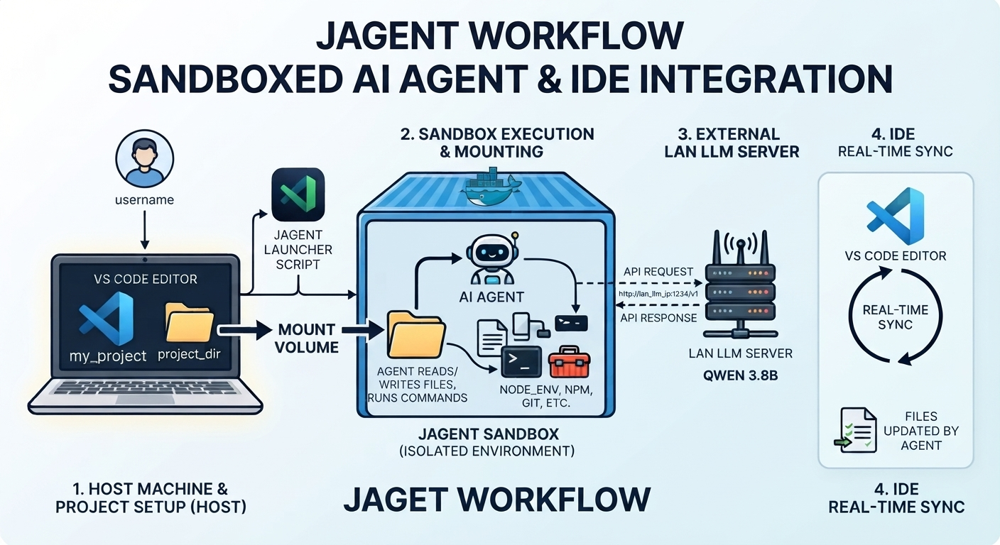

# Jagent

An experimental workflow for constraining an AI coding agent within a securely configured container.



## Disclaimer

Jagent uses [Colima](https://github.com/abiosoft/colima) instead of Docker Desktop because its networking setup allows the container to to connect to an LLM machine on a separate host on the local network.

At the moment, the project is designed and tested only with the Goose CLI; other agent CLIs are not currently supported.

## The Project

This project explores how to make an AI coding agent, behave within clear container boundaries.

The central question is how to balance two kinds of control:

- **Strong sandboxing:** run without root privileges or setuid behavior, prevent privilege escalation, and expose only the intended working directory.
- **Agent configuration:** limit what the agent can do, avoid unrestricted shell access, and require manual approval before changes or other sensitive actions.

The goal is defense in depth. Container isolation limits the impact of a misbehaving agent, while Goose configuration limits the actions the agent is allowed to request. Neither layer should be treated as a complete security boundary on its own.

## Getting Started

Install Colima with Homebrew and start it with Docker runtime networking enabled:

```bash
brew install colima
colima start --runtime docker --network --network-address
```

 Put an `agent-config.yaml` file in a project workdir. Copy the template over and customize it:

```bash
cp templates/agent-config.yaml.template /path/to/your-project/agent-config.yaml
```

Review the provider, model, endpoint, approval mode (approval), and enabled extensions before launching an agent.

Launch the agent with the project workdir:

```bash
python3 run-agent.py /path/to/your-project
```
